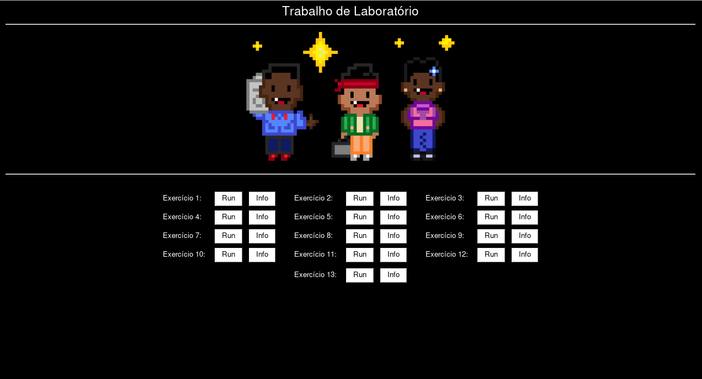

# Trabalho de Laboratório de Programação

Um projeto para a disciplina de Laboratório de Programação, onde o objetivo é criar um pequeno sistema para perguntar ao usuário qual dos scripts shell ele deseja executar.

## Requisitos

### Básicos

Requisitos para rodar qualquer um dos scripts (`menu_cli` ou `interface`).

- Uma máquina com Linux, ou Windows 10 com WSL2;
- Python 3.6 ou superior;

### Interface

Requisitos para rodar o script `interface.py`.

- PySimpleGUI;
- gnome-shell.

No caso do Windows com WSL, também é possível executar sem o gnome-shell, com uma gambiarra descrita na próxima seção.

## Como executar

Abra um terminal Linux (ou WSL).

### Linux

- Clone o repositório
    - `git clone https://github.com/DanielNasc/lab-trabalho.git`
- Entre no diretório
    - `cd lab-trabalho`
- Execute o CLI
    - `python3 menu_cli.py`
- Ou baixe a biblioteca requerida
    - `pip install -r requirements.txt`
- E execute o script
    - `python3 interface.py`

### Windows (com Interface)

- Instale o Python 3.6 ou superior no **Windows**, ou seja, não no WSL;
- Abra o PowerShell;
- Instale o PySimpleGUI;
- Clone o repositório
    - `git clone https://github.com/DanielNasc/lab-trabalho.git`
- Entre no diretório
    - `cd lab-trabalho`
- Execute o script
    - `python.exe interface.py`

Quando você selecionar um programa na interface, irá aparecer uma tela de "Abrir com".
Você deve selecionar o arquivo `gambiarra.cmd` dentro deste repositório.
Ele irá abrir uma janela do cmd que executará o programa shell no WSL.

### Windows (com CLI)

- Abra o WSL2;
- Clone o repositório
    - `git clone https://github.com/DanielNasc/lab-trabalho.git`
- Entre no diretório
    - `cd lab-trabalho`
- Execute o programa
    - `python3 menu_cli.py`

## Desenvolvedores
- [Daniel Nascimento](https://github.com/DanielNasc)
- [Luma Araújo](https://github.com/Sahinake)